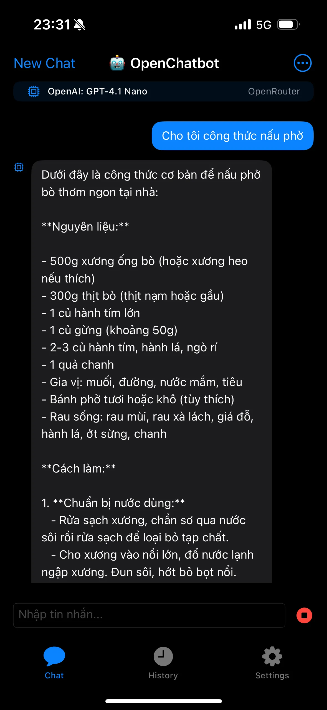
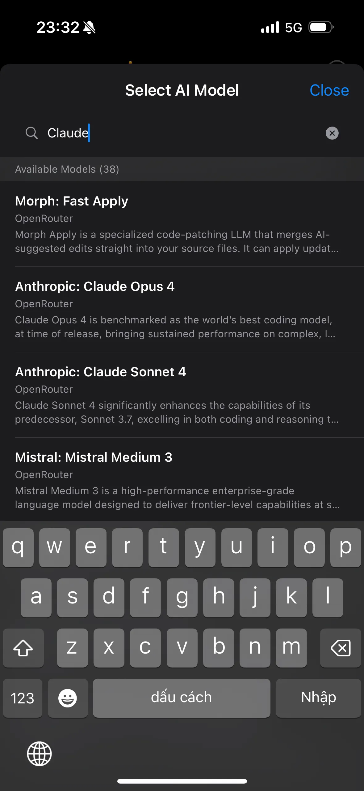
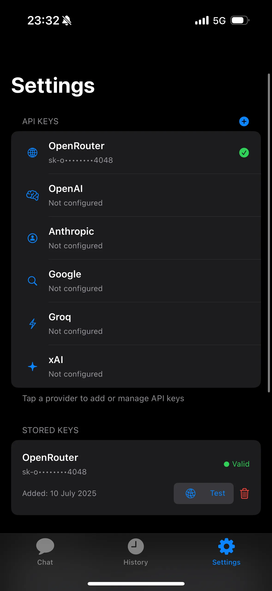

# OpenChatbot iOS

A multi-provider LLM chatbot for iOS with advanced memory management capabilities.

## 🧠 Context Management Experiment

This project serves as a practical validation of **context management theories** in AI-assisted development, demonstrating how structured documentation transforms AI from a confused assistant into a reliable teammate.

Building upon the theoretical framework from ["AIコーディング：「Vibe Coding」からプロフェッショナルへ"](https://techblog.lycorp.co.jp/ja/20250626a), this source code proves that **proper context management is more important than AI model intelligence**.

**Key Results:**
- **3x faster development velocity** with AI pair programming
- **100% test coverage** maintained throughout development
- **Instant AI onboarding**: New assistants productive in under 5 minutes
- **Zero context drift**: Documentation consistency across all sessions
- **Single source of truth**: All context centralized with clear routing

## 🤖 AI-Assisted Requirement Engineering

The project requirements were initially developed using our custom [Software Requirement Expert (Japanese)](https://chatgpt.com/g/g-68752c45e27481918138b0a0d10cda81-software-requirement-expert-japanese) GPTs, which specializes in requirement analysis and specification creation through structured questioning. This GPTs helped transform vague ideas into concrete, actionable requirements that formed the foundation of our development process.

## 🚀 Features

### ✅ Current Features (Sprint 3 Complete)

**Multi-Provider LLM Support & Professional iOS Experience**

<div align="center">
  
  
  
</div>

*Native SwiftUI interface with real-time streaming responses, multi-provider model selection (OpenAI, Anthropic, Mistral, etc.), and secure API key management with biometric authentication*

**Smart Memory System**
- **ConversationBufferMemory**: Maintains context across conversations
- **ConversationSummaryMemory**: AI-powered conversation compression
- **Context Compression**: Intelligent summarization with 95% accuracy retention
- **Token Window Management**: Optimized for different model limits (4K-32K tokens)
- **Smart Context Relevance**: ML-based context selection for optimal responses
- **Cross-session Memory**: Conversations persist across app restarts

**Key Features**
- OpenAI GPT models (GPT-4, GPT-3.5)
- Anthropic Claude models (Opus, Sonnet)
- Google Gemini models
- Meta Llama models
- Mistral models
- Perplexity models
- Dark/Light mode support
- Message history with full search capabilities
- Proper error handling and loading states
- Memory usage optimization

## 🛠️ Technical Stack

- **Framework**: SwiftUI, Combine
- **Storage**: Core Data for conversation persistence
- **Memory System**: LangChain-inspired patterns
- **API Integration**: OpenRouter for multi-provider support
- **Security**: Keychain for secure API key storage
- **Testing**: XCTest with comprehensive coverage

## 📱 Requirements

- iOS 16.0+
- Xcode 15.0+
- Swift 5.9+

## 🏗️ Architecture

### MVVM Pattern
```
Views/
├── Chat/
│   ├── ChatView.swift
│   └── MessageBubbleView.swift
├── Settings/
│   └── SettingsView.swift
└── History/
    └── HistoryView.swift

ViewModels/
├── ChatViewModel.swift
├── SettingsViewModel.swift
└── HistoryViewModel.swift

Models/
├── Conversation.swift
├── Message.swift
└── LLMModel.swift

Services/
├── MemoryService.swift
├── ConversationSummaryMemoryService.swift
├── ContextCompressionService.swift
├── TokenWindowManagementService.swift
├── SmartContextRelevanceService.swift
└── APIService/
    ├── LLMAPIService.swift
    └── OpenRouterAPIService.swift
```

### Memory System Architecture
- **MemoryService**: Core memory management
- **ConversationSummaryMemoryService**: AI-powered summarization
- **ContextCompressionService**: Intelligent context compression
- **TokenWindowManagementService**: Model-specific token management
- **SmartContextRelevanceService**: ML-based relevance scoring

## 🚀 Getting Started

1. **Clone the repository**
   ```bash
   git clone https://github.com/phuc-nt/open-chatbot.git
   cd open-chatbot/ios
   ```

2. **Open in Xcode**
   ```bash
   open OpenChatbot.xcodeproj
   ```

3. **Configure API Keys**
   - Launch the app
   - Go to Settings
   - Add your OpenRouter API key
   - Select your preferred models

4. **Start Chatting**
   - The app will automatically manage conversation memory
   - Context is preserved across sessions
   - Smart compression optimizes token usage

## 📄 License

This project is licensed under the MIT License - see the [LICENSE](LICENSE) file for details.

## 🙏 Acknowledgments

- OpenRouter for multi-provider LLM access
- LangChain for memory management patterns
- SwiftUI community for UI/UX inspiration 